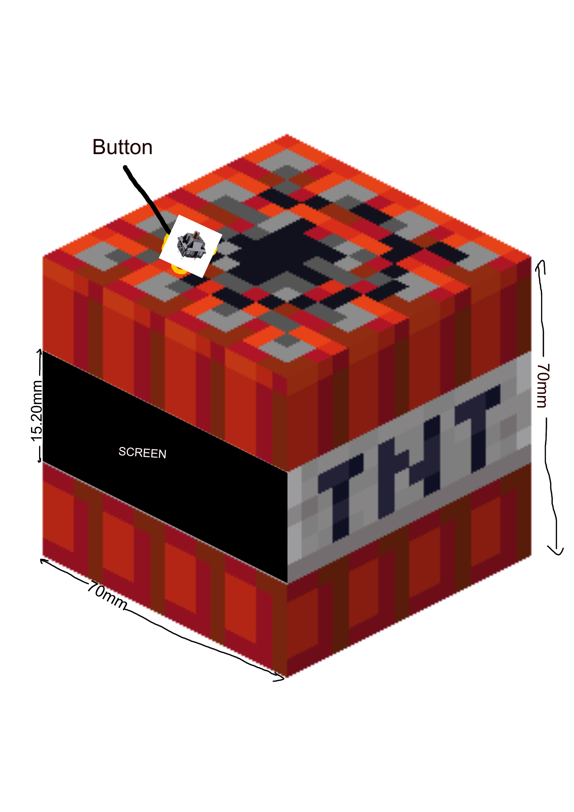
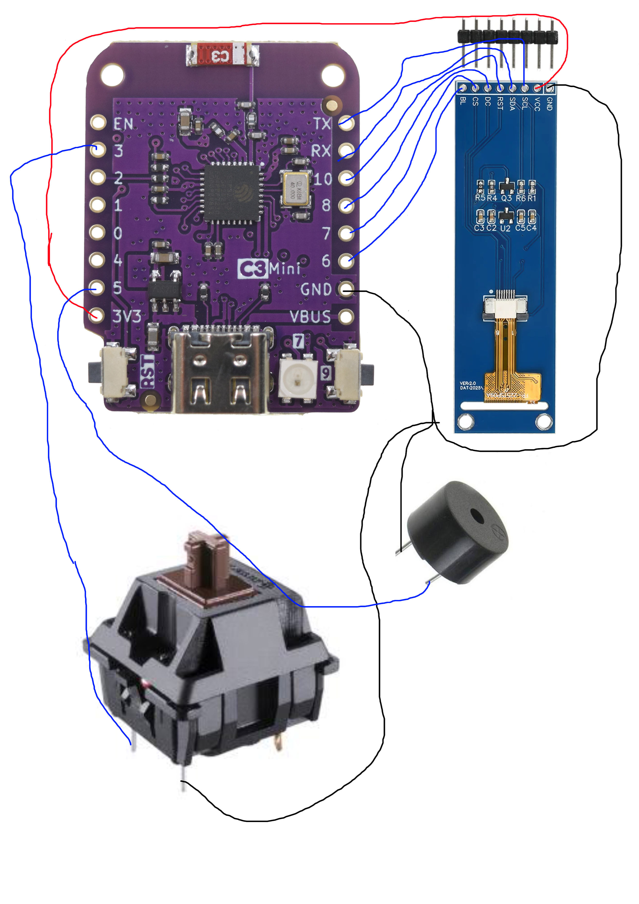
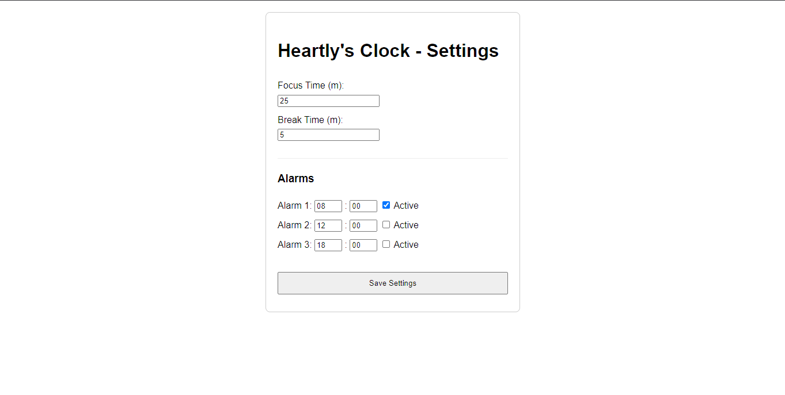

# TNT clock

A custom alarm clock which can be controlled via webserver which also has pomodoro functionalityyy!! in theme of minecraft tnt block.

## Features:
* Shows current time. kinda like a desk clock
* Acts as a alarm that can be set by accessing the webserver
* Also can pomodoro functionality!!
* A adapter hole in side :D

## How to use:
* ### during idle:
    * Long press to change mode to focus
    
* ### during focus mode:
    * Long press to change mode to break
    * single press to pause/resume

* ### during break mode:
    * Long press to change mode to idle
    * single press to pause/resume

* ### when alarm:
    * Long press to change mode to snooze
    * single press to stop alarm

## design:

## rough design:

## encloser:

## circuit in mind:

## web:

## BOM:
* ### FROM KIT:
    * 1x Lolin C3 Mini ESP 32 Devboard
    * 1x Keyboard Switches
    * 1x 2.25in TFT Screen
    * 1x 3.3V Piezo Buzzer
    * 10x M-M Jumper Cables
    * 10x F-M Jumper Cables
    * 10x F-F Jumper Cables

* ### OUTSIDE OF KIT:
    * 1x Small bread board: 
        * cost: $0.74  
        * link: https://www.aliexpress.com/item/1005007593618060.html
