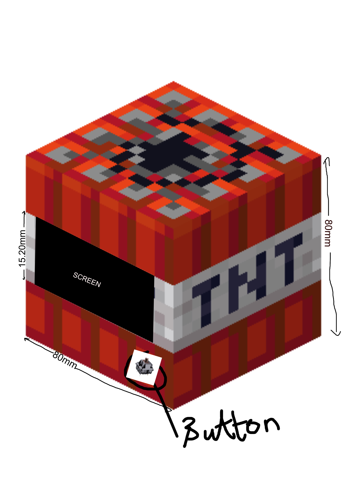
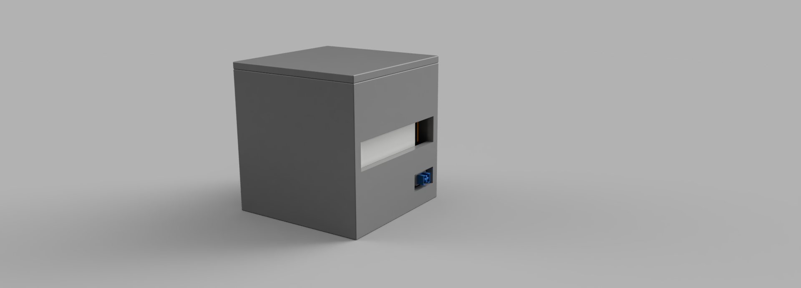
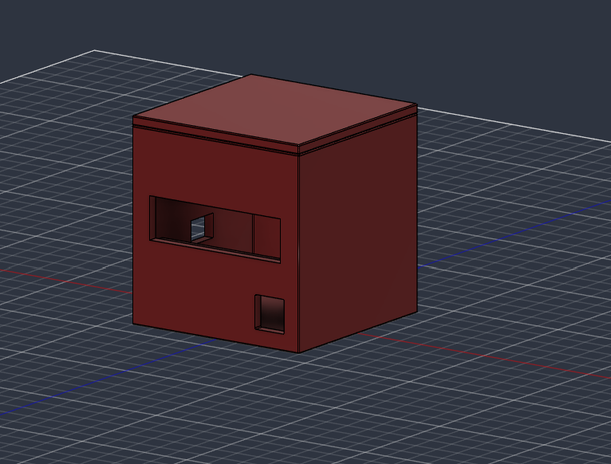
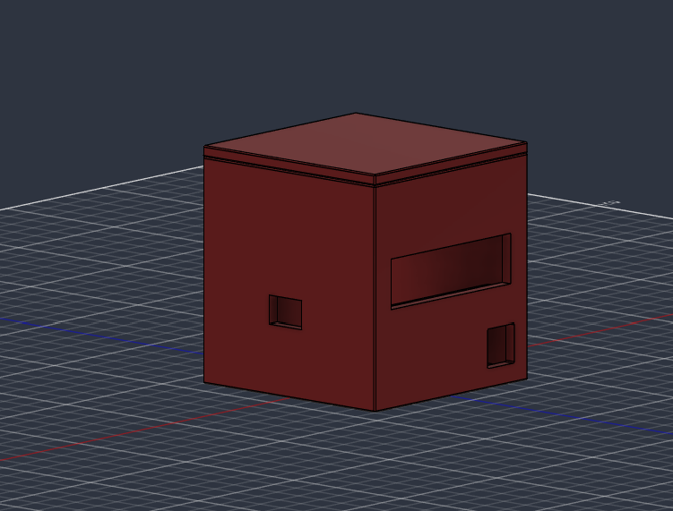
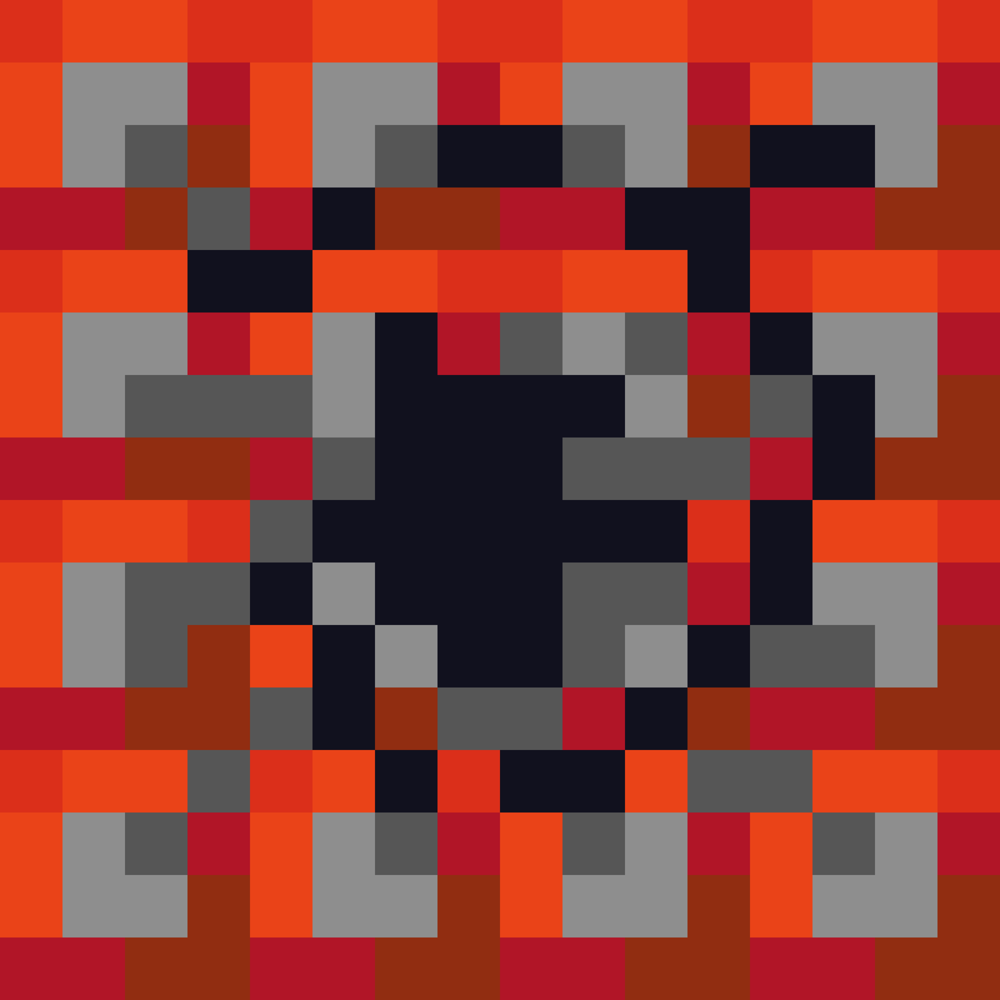

## Total time spent: 8.1 Hours

# June 29: Planning!

### Kit:
* Lolin C3 Mini ESP 32
* 2.25in TFT display
* 12 Keyboard Switches
* A 3.3V Piezo Buzzer
* Some Jumper Cables for wiring

I was wondering what what could I buildd.. and After a lot of thinking, I came to the conclusion that Imma make a custom alarm clock and since lolin C3 has wifi capability.. I'm gonna use it to set alarms and one key from the kit to stop the alarm so that I have to actually wake up and press it to stop.

So for now, this are the things that I'm planning to use:

* Lolin C3 Mini ESP 32
* 2.25in TFT display (To display smth.. not fixed till now)
* 1 Keyboard Switch
* A 3.3V Piezo Buzzer
* Jumper Cables

**Time spent: 1.3h**

 
 

# June 30: Wiring :D

I was gonna make wiring in wokwi but turns out there is no esp32 C3 mini so again I was gonna with the ms paint like in the guide but idk whyy but I felt really odd using it.. SOooo I went with affinity ;D immagine using affinity for circuit design 😂.

Anyways so I build did some document reading to see the pins for each component and finilized on this circuit design:

Sooo I mean not a bad design (I think so..)

**Time spent: 1.1h**

 
 

# July 1: Encloser and overall clock design!!!!
### LETS GO WITH MINECRAFT THEME

so I was thinking of what to do with the design element of the clock and at first I was wondering if I could make it like aesthetic desk clock style but.. It won't be as cool as minecraft design if I wana showoff to my friends!  

So I went with a tnt design (square with button on top, and screen in one of the faces.) but the issue is that I'm very beginner in CAD. I hope I can design this..

**FOR REFERENCE:**

**Time spent: 30min**

 
 

# July 1 - revisit: Revisiting the design!!!
### Small issueee

while doing some more research on the display and size I was gonna set.. turns out the display is .5mm larger than what we were going with so we will be extending the side's length to 80mm. (since 4mm will be the thickness of encloser)

**Time spent: 5min**

 
 

# July 1 - CAD: CAD and also re-thinking of design!
### First of all about design:
I changed the position of circuit from top to placing it in the bottom..

### About CAD:
I designed the cad for the encloser according to the design i had in mind.. Still its one of my first time so hope it works...

**Time spent: 1h**

 
 

# July 5 - Back after a busy long days..
### I was little busy due to events but now I'm backkk!!!
So for today.. I think I have finished this project!!

### Little change in plan
Instead of just normal alarm clock with wireless config option, I also added pomodoro functionality!!

### Firmware
I completed all the firmware part of this project with web server support.. I mean I had little issue with library so I had to involve AI. Beside that I also added a "secret.h" file which contains my wifi password which is hidden so that I don't expose my wifi pass to the world :D

### Assembling
I did the assembling in fusion and rendered the looks of this project!! it looks sooo cooollll but colorless... I mean its in design of tnt so I'm thinking of coloring it with chart paper cuz minecraft pixel art dw dw.

**Time spent: 2h(hackatime) + 0.7h(CAD, NEW DESIGN and ALL)**

 
 

# July 7-9 - I was little busy so I did little progress each day
### So I had some adjustment to do.. First of all, I assembled the project virtually and used breadboard for keeping the buzzer and controller in place, I think I can use tape for display but made a mount for it, and I also adjusted the hole for switch. And at last, I made hole for connecting adapter to the microcontroller!

Sooo the project kinda comese to an end with all this adjustments and I will build this in "real" after kit arrives!

so here are the updated ss:

### I also made template design for the outer face of encloser:

**Time spent: 1.5hr**

 
 